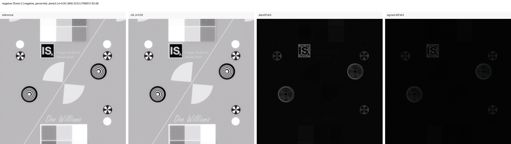
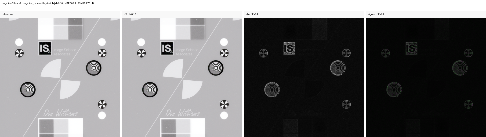
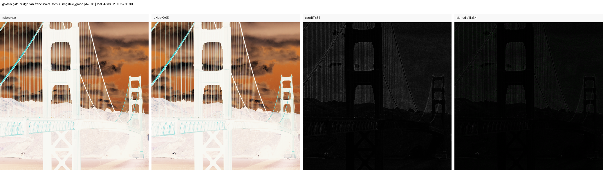
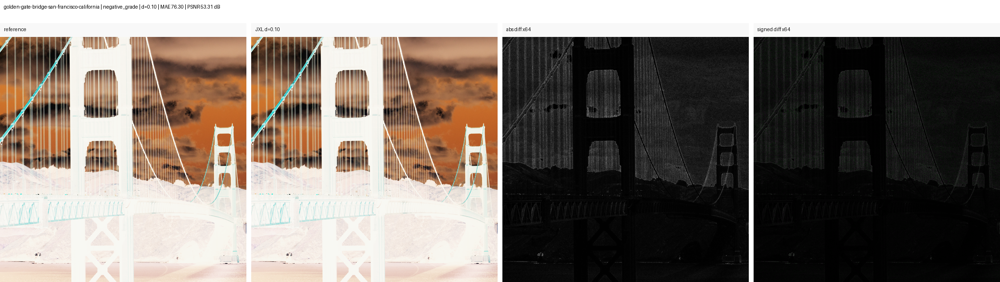

# Public Smoke Test

This page shows the first public, reproducible latitude-stress smoke test.

It is not the final proof of the project hypothesis. Its job is simpler: confirm
that the public tooling works, that the result can be reproduced from public
test images, and that JPEG XL distance settings produce measurable and visible
differences under negative-like transforms.

## Inputs

- FADGI/OpenDICE `Negative 35mm_2.tif`
- Library of Congress Highsmith `Golden Gate Bridge, San Francisco, California`

Both were downloaded with:

```powershell
python scripts\download_testdata.py --include-loc --loc-count 3
```

## Command

```powershell
python scripts\run_public_latitude_stress.py `
  "testdata\fadgi_opendice\negative_35mm_2\Negative 35mm_2.tif" `
  "testdata\library_of_congress\highsmith\golden-gate-bridge-san-francisco-california.tif" `
  --distance 0.05 --distance 0.10 `
  --crop-size 2048 `
  --out-dir results\public_latitude_stress_smoke_clean

python scripts\make_public_crop_panels.py results\public_latitude_stress_smoke_clean
```

Each panel shows:

1. reference crop
2. decoded JPEG XL candidate
3. amplified absolute difference
4. amplified signed difference

The difference panels are diagnostic views, not normal viewing conditions.

## Results

| Image | Distance | Transform | MAE | PSNR | p99 pixel max error |
|---|---:|---|---:|---:|---:|
| FADGI Negative 35mm 2 | 0.05 | negative stretch | 33.92 | 57.83 dB | 438.3 |
| FADGI Negative 35mm 2 | 0.10 | negative stretch | 50.91 | 54.75 dB | 641.2 |
| LOC Golden Gate | 0.05 | negative grade | 47.36 | 57.35 dB | 507.3 |
| LOC Golden Gate | 0.10 | negative grade | 76.30 | 53.31 dB | 798.6 |

## FADGI Target

### JPEG XL d=0.05



### JPEG XL d=0.10



## LOC Photograph

### JPEG XL d=0.05



### JPEG XL d=0.10



## Interpretation

This first public smoke test supports three modest claims:

- The public pipeline works from downloadable test data.
- JPEG XL `d=0.10` is consistently worse than `d=0.05` in these tests.
- Negative-like transforms and steep tonal edits can make the spatial pattern of
  compression error easier to see.

It does not prove that `d=0.05` is archival-safe. It also does not fully recreate
the private FilmLab inversion test, where mean error was amplified much more
strongly. The next step is to make the automated negative-like transform more
representative and repeat this across more public and newly photographed
anonymous film material.
