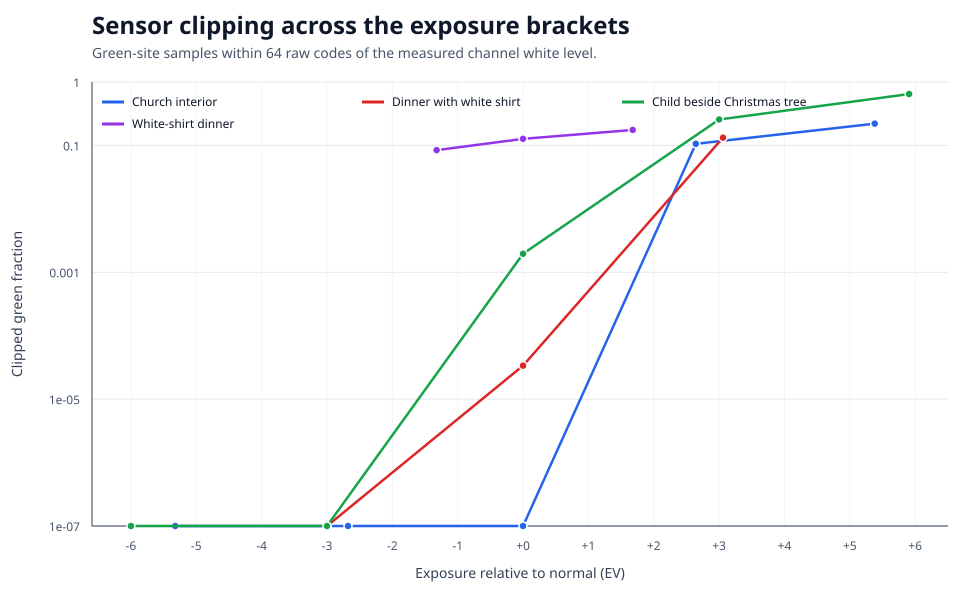
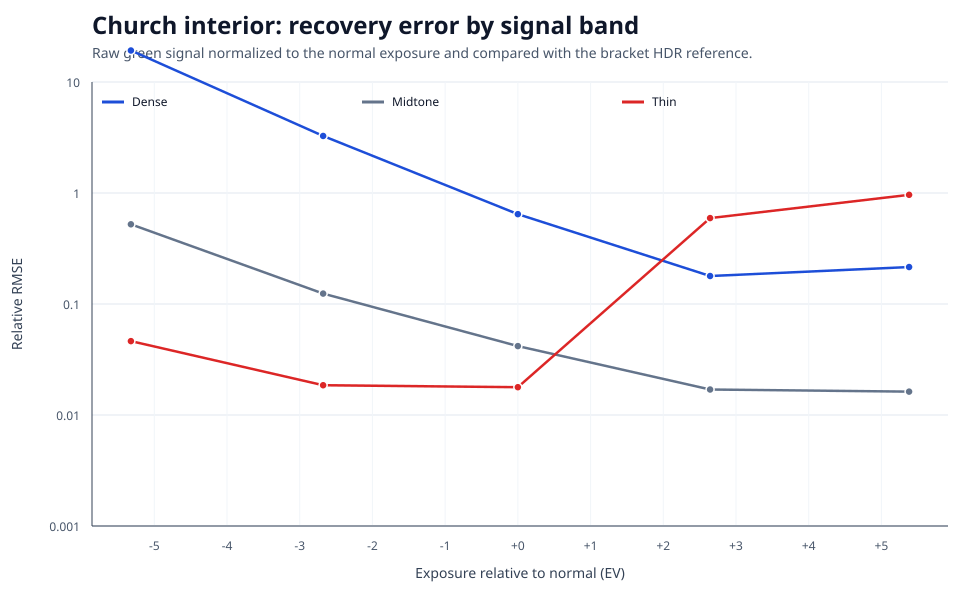
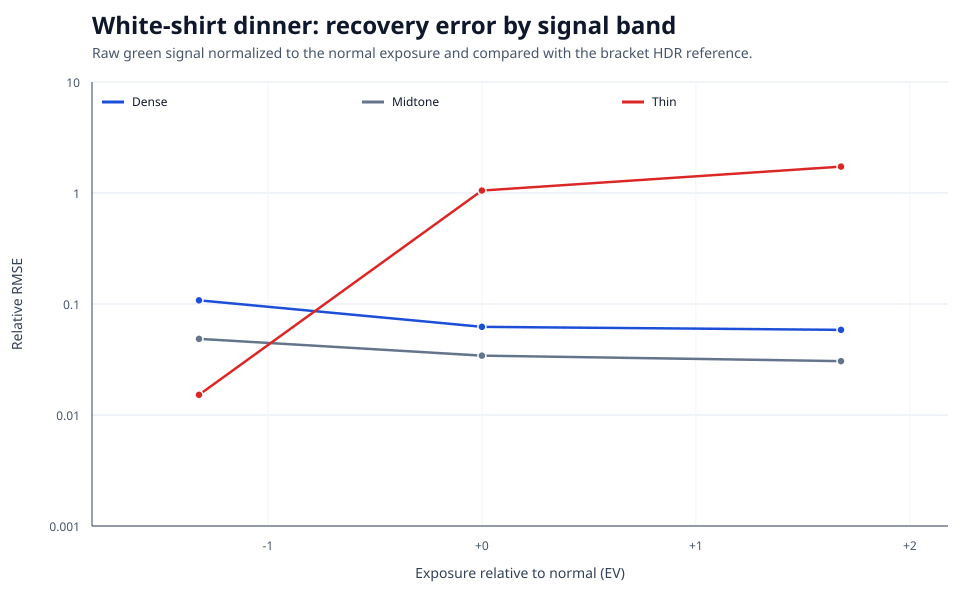

# Controlled Exposure Latitude Audit

The 2026-09-17 [source and aggregate audit](../site/data/controlled-evidence.json) retains these sensor-domain measurements. It records current source hashes and clarifies that original-run hashes were unavailable and the bracket reference is not independent scene truth. This experiment is separate from the corrected combiner and JPEG XL results.

## Question

Does a meter-normal single-shot ARW retain the recoverable high- and low-signal
information in a camera-scanned transparency, or can an exposure bracket reveal
structure that the normal capture has already clipped or buried near the sensor
black level?

This audit calibrates the RAW61 tonal anchor used elsewhere in the project. It
does **not** compare Sony ARQ, PixelShift2DNG, or JPEG XL. Its job is narrower:
measure how much latitude the source single-shot raw capture actually contains
before using that capture as evidence about a PixelShift combiner or codec.

## Material

The local Laowa slide-test folder contained four complete, stationary,
single-shot ARW brackets. Together they provide 16 captures at ISO 100:

| Case | Frames | Reported EV range | Why it is useful |
| --- | ---: | ---: | --- |
| Church interior | 5 | -5.32 to +5.38 | Bright windows and a very dark interior |
| Dinner with white shirt | 3 | -3.00 to +3.06 | White fabric against dark clothing/background |
| Child beside Christmas tree | 5 | -6.00 to +5.91 | Broad technical stress range |
| White-shirt dinner | 3 | -1.32 to +1.68 | Fine bracket around a visibly difficult white area |

ExifTool reported ISO 100, manual focus, unchanged raw geometry, and no Pixel
Shift payload for every included capture. The manual Laowa lens reports
`FNumber=0`, so aperture constancy cannot be proven from EXIF. The complete
brackets were captured in less than a second apart from exposures whose shutter
time itself was longer.

The source ARWs remain private and outside Git. The tracked plan contains only
relative filenames; the public result contains numerical measurements and plots,
not source pixels.

The exact bracket membership and sensor response are:

| Case | File | Shutter | Reported EV | Measured EV | Max CFA-channel clip |
| --- | --- | ---: | ---: | ---: | ---: |
| Church | `church/DSC05317.ARW` | 1/5000 s | -5.32 | -5.294 | 0.000% |
| Church | `church/DSC05315.ARW` | 1/800 s | -2.68 | -2.661 | 0.000% |
| Church | **`church/DSC05314.ARW`** | **1/125 s** | **0.00** | **0.000** | **0.000%** |
| Church | `church/DSC05316.ARW` | 1/20 s | +2.64 | +2.668 | 10.613% |
| Church | `church/DSC05318.ARW` | 1/3 s | +5.38 | +5.338 | 22.049% |
| Dinner | `New folder/DSC05299.ARW` | 1/400 s | -3.00 | -3.004 | 0.000% |
| Dinner | **`New folder/DSC05298.ARW`** | **1/50 s** | **0.00** | **0.000** | **0.003%** |
| Dinner | `New folder/DSC05300.ARW` | 1/6 s | +3.06 | +3.006 | 13.255% |
| Christmas | `_DSC5306.ARW` | 1/640 s | -6.00 | -5.996 | 0.000% |
| Christmas | `_DSC5304.ARW` | 1/80 s | -3.00 | -3.007 | 0.000% |
| Christmas | **`_DSC5303.ARW`** | **1/10 s** | **0.00** | **0.000** | **0.197%** |
| Christmas | `_DSC5305.ARW` | 0.8 s | +3.00 | +3.007 | 25.643% |
| Christmas | `_DSC5307.ARW` | 6 s | +5.91 | +6.006 | 64.646% |
| White shirt | `whiteshirt/DSC05328.ARW` | 1/20 s | -1.32 | -1.505 | 8.434% |
| White shirt | **`whiteshirt/DSC05327.ARW`** | **1/8 s** | **0.00** | **0.000** | **12.704%** |
| White shirt | `whiteshirt/DSC05329.ARW` | 0.4 s | +1.68 | +1.504 | 17.553% |

Bold rows are the declared normal exposures. Every row is ISO 100, manual
focus, 9504 x 6336 raw geometry, and has no active Pixel Shift payload. The
manual lens records `FNumber=0`, so no numerical aperture claim is made.

## Sensor-domain method

The analysis is deliberately upstream of demosaic, white balance, ICC profiles,
and tone curves:

1. LibRaw/rawpy decodes each ARW mosaic without rendering it.
2. Each CFA sample is black-subtracted and divided by its camera channel range.
3. The two green sites are averaged on the complete 3188 x 4782 Bayer-cell grid
   for structure and recovery metrics; no cells are spatially subsampled. R,
   G1, G2, and B clipping fractions are retained separately.
4. Reported shutter time supplies the displayed EV. A robust median response in
   non-clipped midtones supplies the normalization EV, avoiding nominal shutter
   rounding and small illumination/exposure deviations.
5. A bracket HDR reference is built in normal-equivalent raw space. Non-clipped
   samples are weighted by measured exposure. Each frame is scored against a
   leave-one-out reference that excludes that frame, preventing a source image
   from receiving an artificial zero error against itself.
6. An 8% outer inset removes slide-holder/frame edges before signal bands are
   selected. Dense, midtone, and thin bands are reference percentiles 1-10,
   35-65, and 90-99.
7. The audit records relative RMSE, relative p95 error, Laplacian structure
   correlation, near-black fraction, and clipping. A sample is conservatively
   counted as clipped within 64 raw codes of its LibRaw camera white level.

The method is implemented in
[`scripts/run_controlled_exposure_latitude.py`](../scripts/run_controlled_exposure_latitude.py).
The complete machine-readable result is
[`metadata/controlled_exposure_latitude.json`](../metadata/controlled_exposure_latitude.json).

## Exposure validation

The median absolute difference between reported shutter EV and measured raw
response was **0.012 EV** across the 16 captures. The maximum was **0.183 EV**,
in the nominal +/-1.5 EV white-shirt bracket where EXIF exposes rounded shutter
values (`1/20`, `1/8`, `0.4 s`) while the raw response is almost exactly spaced
by 1.5 EV.

This tight agreement supports treating the sets as shutter-only exposure
brackets. It does not independently verify the manual aperture.

## Results

| Case | Normal-frame max channel clip | Best dense exposure | Dense RMSE improvement | Best recoverable thin exposure | Main reading |
| --- | ---: | ---: | ---: | ---: | --- |
| Church | 0.000% | +2.64 EV | 3.61x | 0 EV | Normal protects the windows; +2.64 EV recovers materially more dark-interior structure but clips the thin band completely. |
| Dinner | 0.003% | 0 EV | 1.00x | -3 EV, effectively tied with 0 | Normal already balances both evaluated tails; +3.06 EV clips the thin band completely without improving the dense band. |
| Christmas | 0.197% | +5.91 EV | 3.04x | 0 EV | +3 EV already reaches nearly the same dense-band error as +5.91 EV; the extreme exposure adds little and clips much more. |
| White shirt | 12.704% | +1.68 EV | 1.06x | -1.32 EV | Normal clips important white-shirt signal. The shorter exposure cuts recoverable thin-band error by 69.2x, yet the bracket still clips 8.76% of the analysis grid in every frame. |

“Best recoverable thin exposure” is evaluated only where at least one bracket
frame remains non-clipped. The explicit all-frames-clipped statistic prevents
the white-shirt failure from disappearing through HDR masking.

The practical result is asymmetric:

- Three normal exposures preserve the evaluated thin/high-signal tail with
  negligible channel clipping. The white-shirt normal does not.
- Longer exposures improve dense/low-signal recovery materially in the church
  and Christmas cases, modestly in the white-shirt case, and not in the dinner
  case.
- Extreme positive brackets are inefficient. In the Christmas set, +3 EV and
  +5.91 EV have dense-band relative RMSE 0.0274 and 0.0266, while whole-frame
  green clipping rises from 25.6% to 64.6%.
- A single meter-normal capture is therefore not a guaranteed latitude ground
  truth. It is adequate for several scenes, but scene-dependent clipping or
  dense-region noise can make another bracket exposure demonstrably better.







## Consequence for the combiner audit

The earlier PixelShift-combiner audit found that Sony ARQ followed the source
ARW tone distribution more closely while PixelShift2DNG retained a closer
high-pass structure relationship. This bracket audit sharpens the boundary of
that claim:

- tonal closeness to a normal ARW is evidence about tone response;
- it is not automatically evidence that the normal ARW contains all recoverable
  dense- or thin-region structure;
- future ARQ-versus-PixelShift2DNG latitude work should use bracket-validated
  anchors or an HDR reference, particularly for visibly clipped white areas and
  dense transparency regions.

For the current material, the church normal is a sound thin-region anchor but a
weaker dense-region reference. The white-shirt normal is not a sound thin-region
anchor because the raw mosaic is already materially clipped.

## Reproduction

Install the raw-analysis extra and make ExifTool available:

```powershell
python -m pip install -e ".[raw]"
python scripts\run_controlled_exposure_latitude.py `
  --source-root "C:\path\to\test-laowa"
```

The command regenerates the ignored full result under
`results/controlled_exposure_latitude`, the tracked numerical summary, and the
pixel-free SVG figures.

## Limits

- Four slide scenes and one camera/lens/light setup do not define universal
  exposure guidance.
- The bracket HDR is an internal reference assembled from the other exposures,
  not an independently calibrated densitometer measurement.
- There are no same-exposure repeats, so the audit measures recovery fidelity
  against the bracket rather than separating photon noise, read noise, and film
  texture with a formal noise model.
- Structure metrics use the two green CFA sites. Channel-specific clipping is
  reported, but equivalent red/blue structure metrics are not.
- The source files are private, so the code and result format are reproducible
  while this exact numerical run is not independently repeatable from Git alone.
- This run does not include ARQ, PixelShift2DNG, Pixel Shift 4/16, or JPEG XL;
  it calibrates the single-shot raw exposure baseline those comparisons use.
