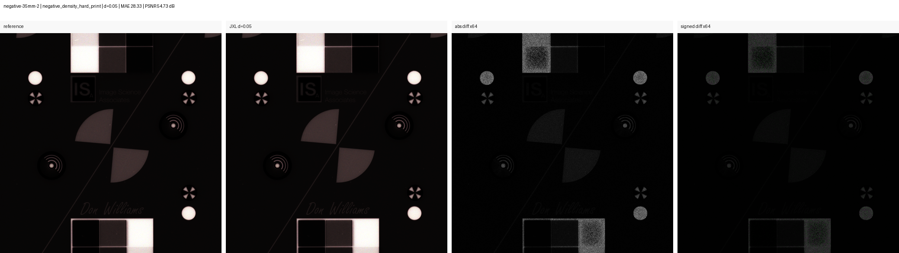
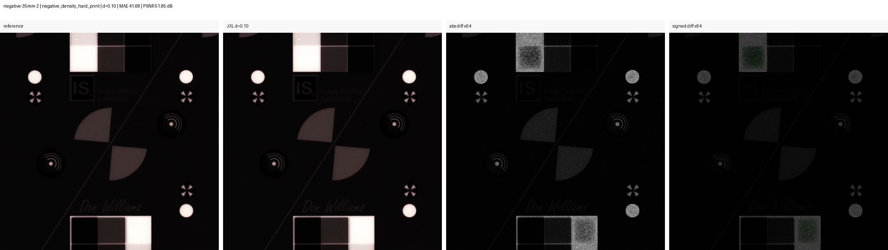
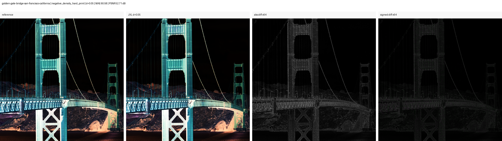
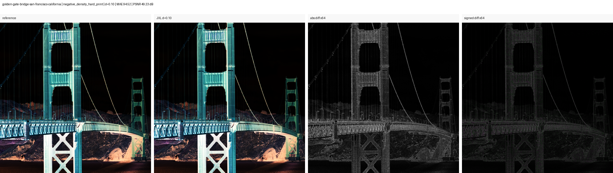
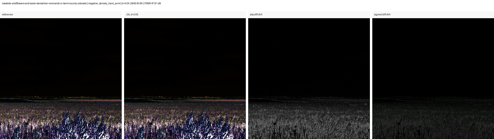
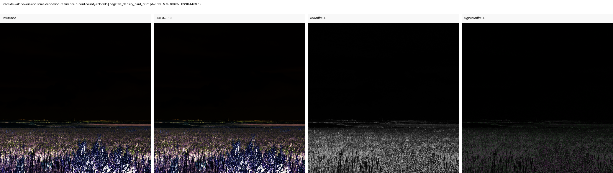

# Public Latitude Stress v2

This page documents the second public latitude-stress run. Compared with the
first smoke test, this run adds density-based negative-print transforms that are
closer to the kind of tonal stress expected when a color negative is inverted
and graded.

It is still not a final archival proof. It is a reproducible public stress test
that helps rank JPEG XL distance settings and reveal whether small compression
errors become more visible after hard editing.

## Where the post-inversion test happens

The JPEG XL encode is performed on the fixed linear/rendered source first. After
decoding, both the reference and candidate are passed through the same
`negative_density_*` transform before error metrics are calculated. This is a
**post-codec, post-inversion-like stress test**: it tests whether codec
differences are amplified by a negative-to-positive density curve.

It is not a claim that the transform reproduces FilmLab, Negative Lab Pro, or
any other particular inverter. An application-specific export remains a useful
second test, but its result must be labelled by application, profile, and
settings rather than treated as a universal inversion result.

## Inputs

The run used 2048 px center crops from six public images:

- FADGI/OpenDICE `Negative_35mm_ICC.tif`
- FADGI/OpenDICE `Negative 35mm_2.tif`
- FADGI/OpenDICE `Positive 35mm.tif`
- Library of Congress Highsmith `Golden Gate Bridge, San Francisco, California`
- Library of Congress Highsmith `Roadside wildflowers... Bent County, Colorado`
- Library of Congress Highsmith `The Caloosahatchee Bridge...`

The FADGI grayscale target is expanded to RGB for JPEG XL testing. Its grayscale
ICC profile is intentionally not attached to that RGB encode, because `cjxl`
rejects a grayscale profile on RGB data.

## Command

```powershell
python scripts\run_public_latitude_v2.py --publish-figures
```

The wrapper runs the stress test, creates visual panels, and copies the selected
publication figures into `docs/figures/public-latitude-v2`. The full generated
metrics live in `results/public_latitude_stress_v2/metrics.csv`. The generated
panel index lives in `results/public_latitude_stress_v2/PANELS.md`. The
tool-version snapshot lives in
`results/public_latitude_stress_v2/tool_versions.json`. A matching
`run_manifest.json` binds the result parameters, input and code hashes, tool
environment, and generated stress artifacts to that snapshot. The `results/`
directory is local generated output and is intentionally ignored by Git.

For clean reproduction steps, see [REPRODUCIBILITY.md](../REPRODUCIBILITY.md).

## Metrics

All metrics below are measured on a 16-bit scale. `MAE` is mean absolute error.
`p99 pixel max error` is the 99th percentile of per-pixel maximum channel error.
Encoded size is the average JPEG XL size for the 2048 px crop, not for the full
source TIFF.

| Transform | JXL distance | Avg MAE | Avg PSNR | Avg p99 pixel max error | Avg encoded crop |
|---|---:|---:|---:|---:|---:|
| identity | 0.03 | 30.17 | 60.68 dB | 311.8 | 3.94 MiB |
| identity | 0.05 | 42.12 | 58.30 dB | 389.7 | 3.22 MiB |
| identity | 0.10 | 65.36 | 55.24 dB | 522.8 | 2.40 MiB |
| negative density print | 0.03 | 47.47 | 52.78 dB | 842.6 | 3.94 MiB |
| negative density print | 0.05 | 67.35 | 50.40 dB | 1116.3 | 3.22 MiB |
| negative density print | 0.10 | 103.26 | 47.49 dB | 1529.3 | 2.40 MiB |
| negative density hard print | 0.03 | 53.87 | 50.81 dB | 1185.1 | 3.94 MiB |
| negative density hard print | 0.05 | 77.06 | 48.45 dB | 1607.7 | 3.22 MiB |
| negative density hard print | 0.10 | 118.32 | 45.55 dB | 2188.9 | 2.40 MiB |
| negative density shadow print | 0.03 | 40.52 | 56.55 dB | 576.4 | 3.94 MiB |
| negative density shadow print | 0.05 | 57.15 | 54.13 dB | 720.4 | 3.22 MiB |
| negative density shadow print | 0.10 | 87.60 | 51.11 dB | 949.1 | 2.40 MiB |

## Selected Figures

Each panel shows:

1. reference crop
2. decoded JPEG XL candidate
3. amplified absolute difference
4. amplified signed difference

The difference panels are diagnostic views, not normal viewing conditions.
They are amplified `64x` to show where compression error accumulates; they
should not be read as what the image normally looks like.

The selected public figures are meant to cover three roles:

- **FADGI Negative 35mm 2** is the standardized target-like example. It is the
  most controlled of the selected figures, but not the most visually intuitive.
- **LOC Golden Gate** is the best first figure for readers. It shows a real
  high-contrast subject where the normal view still looks close while the
  diagnostic difference views reveal structured error along edges and texture.
- **LOC Wildflowers** is the fine-texture stress case. It is darker and less
  immediately readable, but useful because the error concentrates in dense,
  low-contrast detail rather than only on hard target edges.

For public sharing, lead with the Golden Gate pair, then use the FADGI target
as the reproducibility anchor and the Wildflowers pair as the texture stress
case.

### FADGI Negative 35mm 2

| Distance | MAE | PSNR | p99 pixel max error |
|---:|---:|---:|---:|
| 0.05 | 28.33 | 54.73 dB | 999.5 |
| 0.10 | 41.68 | 51.85 dB | 1359.7 |





### LOC Golden Gate

| Distance | MAE | PSNR | p99 pixel max error |
|---:|---:|---:|---:|
| 0.05 | 60.58 | 52.71 dB | 980.7 |
| 0.10 | 94.52 | 49.23 dB | 1416.7 |





### LOC Wildflowers

| Distance | MAE | PSNR | p99 pixel max error |
|---:|---:|---:|---:|
| 0.05 | 65.85 | 47.81 dB | 2102.7 |
| 0.10 | 100.05 | 44.69 dB | 2976.5 |





## Interpretation

The main practical result is unchanged but better supported:

- JPEG XL `d=0.10` is consistently and visibly worse than `d=0.05`.
- JPEG XL `d=0.05` remains the most interesting conservative lossy candidate.
- JPEG XL `d=0.03` is cleaner, but the storage saving is smaller.
- Density-based negative-print transforms amplify high-percentile errors much
  more than identity comparison does, which better matches the concern raised by
  real negative inversion and grading.

This does not prove that `d=0.05` is archival-safe. It does make the test harness
more relevant to the actual fear: that a visually small JXL error in a flat
linear positive state becomes objectionable after a latitude-heavy film-negative
workflow.

## Limitations

- These are 2048 px crops, not full-image evaluations.
- The public images are useful stress material, but they are not the same as the
  private PixelShift color-negative camera scans that motivated the project.
- The density transforms approximate a negative-print workflow; they are not a
  film-specific renderer and not a replacement for FilmLab, RawTherapee, or a
  real darkroom-style grading workflow.
- The encoded crop sizes are useful for comparing distance settings, but they
  should not be treated as final storage-ratio claims for full 240 MP scans.
